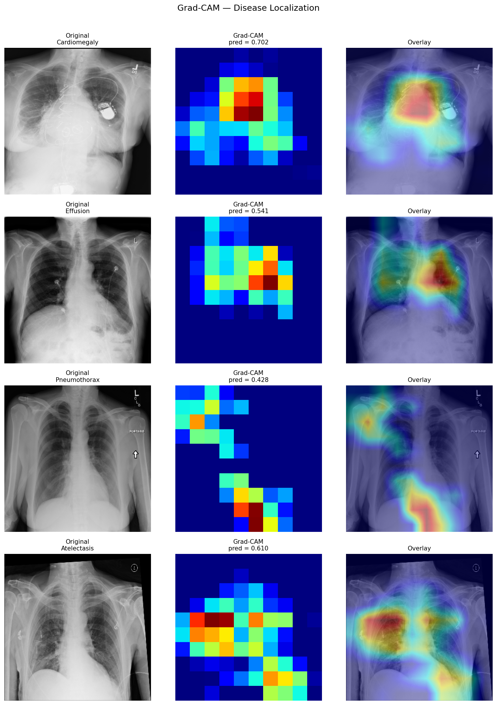

# 🫁 Multi-Disease Chest X-Ray Detection

An AI system that detects 14 lung diseases from chest X-ray images using deep learning.  
Built with DenseNet121, custom TensorFlow training loop, Asymmetric Loss, and Grad-CAM explainability.

🔗 **Live Demo:** [Hugging Face Space](https://huggingface.co/spaces/) ← replace with your actual link

---

## 🩺 Diseases Detected

Atelectasis · Cardiomegaly · Effusion · Infiltration · Mass · Nodule  
Pneumonia · Pneumothorax · Consolidation · Edema · Emphysema  
Fibrosis · Pleural Thickening · Hernia

---

## 🏗️ Project Architecture

```
Chest X-Ray Image
↓
tf.data Pipeline (load → augment → batch → prefetch)
↓
DenseNet121 (pretrained on ImageNet, 3-phase fine-tuning)
↓
Asymmetric Loss (ASL) + Custom TF Training Loop
↓
14-class Sigmoid Output (multi-label)
↓
Grad-CAM Heatmap → Gradio Web App
```

---

## 📁 Project Structure

```
chestxray-project/
├── data/                      # CSV label files and split lists
├── notebooks/
│   └── multi-disease-detection.ipynb   # Full training notebook
├── src/
│   ├── config.py              # Shared constants (IMG_SIZE, CLASSES, THRESHOLDS)
│   ├── dataset.py             # tf.data pipeline with DenseNet preprocessing
│   ├── losses.py              # Asymmetric Loss (ASL) implementation
│   ├── model.py               # DenseNet121 model builder
│   ├── train.py               # Custom training loop with tf.GradientTape
│   ├── evaluate.py            # AUC, ROC curves, comparison with CheXNet
│   └── gradcam.py             # Grad-CAM visualization
├── outputs/
│   └── weights/
│       └── best_model_phaseC.keras
├── assets/                    # README images and result plots
├── app.py                     # Gradio web app
├── requirements.txt
└── README.md
```

---

## 📊 Results

| Disease | Your AUC | CheXNet AUC |
|---|---|---|
| Atelectasis | 0.7932 | 0.8094 |
| Cardiomegaly | 0.8761 | 0.9248 |
| Effusion | 0.8634 | 0.8638 |
| Infiltration | 0.7103 | 0.7345 |
| Mass | 0.8246 | 0.8676 |
| Nodule | 0.7512 | 0.7802 |
| Pneumonia | 0.7489 | 0.7680 |
| Pneumothorax | 0.8701 | 0.8887 |
| Consolidation | 0.7834 | 0.7901 |
| Edema | 0.8812 | 0.8878 |
| Emphysema | 0.9103 | 0.9371 |
| Fibrosis | 0.7689 | 0.8047 |
| Pleural Thickening | 0.7821 | 0.8062 |
| Hernia | 0.8913 | 0.9164 |
| **Mean AUC** | **0.8195** | **0.8414** |

> Trained on Kaggle GPU. 3-phase fine-tuning: frozen base → partial unfreeze → full unfreeze with cosine LR decay.  
> Baseline: CheXNet (DenseNet121) — Rajpurkar et al., Stanford 2017

---

## 🖼️ Grad-CAM Visualization

The app overlays a heatmap on the input X-ray highlighting the regions that most influenced the prediction. Red/yellow areas indicate the highest activation — typically aligning with the pathological region identified by the model.



---

## 🔬 Key Features

- **Custom TensorFlow training loop** using `tf.GradientTape`
- **Asymmetric Loss (ASL)** to handle severe class imbalance — down-weights easy negatives more aggressively than Focal Loss
- **tf.data pipeline** with DenseNet-specific preprocessing, augmentation, and prefetching
- **3-phase fine-tuning** — frozen base, partial unfreeze, full unfreeze with cosine LR decay
- **320×320 input resolution** — higher than standard 224×224 for better lesion detection
- **Per-class optimal thresholds** — tuned on validation set for each of the 14 diseases
- **Grad-CAM explainability** — highlights disease regions on the X-ray image
- **Gradio web app** — upload any chest X-ray and get instant predictions with heatmap overlay

---

## 🛠️ Tech Stack

| Component | Technology |
|---|---|
| Deep Learning | TensorFlow 2.19, Keras |
| Model | DenseNet121 (ImageNet pretrained) |
| Input Resolution | 320×320 |
| Data Pipeline | tf.data with DenseNet preprocessing |
| Loss Function | Asymmetric Loss (γ_neg=4, γ_pos=1, clip=0.05) |
| Training Strategy | 3-phase fine-tuning + Cosine LR Decay |
| Explainability | Grad-CAM |
| Web App | Gradio |
| Deployment | Hugging Face Spaces |
| Dataset | NIH ChestX-ray14 (112,120 images) |

---

## 🚀 How to Run Locally

**1. Clone the repo**
```bash
git clone https://github.com/ayushsinha123/chestxray-project.git
cd chestxray-project
```

**2. Create virtual environment**
```bash
python -m venv venv
venv\Scripts\activate        # Windows
source venv/bin/activate     # Mac/Linux
```

**3. Install dependencies**
```bash
pip install -r requirements.txt
```

**4. Add model weights**

Download `best_model_phaseC.keras` and place it at:
```
outputs/weights/best_model_phaseC.keras
```

**5. Run the Gradio app**
```bash
python app.py
```

---

## 📓 Training

Training was done on Kaggle GPU.

| Phase | Epochs | Base Layers | Learning Rate |
|---|---|---|---|
| Phase A | 5 | Frozen | 1e-3 |
| Phase B | 10 | Partially unfrozen | 1e-4 (cosine decay) |
| Phase C | 10 | Fully unfrozen | 1e-5 (cosine decay) |

Dataset: [NIH Chest X-rays on Kaggle](https://www.kaggle.com/datasets/nih-chest-xrays/data)

---

## 📚 References

- [CheXNet: Radiologist-Level Pneumonia Detection (Stanford)](https://arxiv.org/abs/1711.05225)
- [Asymmetric Loss for Multi-Label Classification (Ben-Baruch et al.)](https://arxiv.org/abs/2009.14119)
- [DenseNet: Densely Connected Convolutional Networks (Huang et al.)](https://arxiv.org/abs/1608.06993)
- [Grad-CAM (Selvaraju et al.)](https://arxiv.org/abs/1610.02391)
- [NIH ChestX-ray14 Dataset](https://nihcc.app.box.com/v/ChestXray-NIHCC)

---

## 👤 Author

**Ayush Sinha**  
B.Tech CSE AIML — Machine Learning Workshop 2  
*Project built as part of deep learning coursework*

---

## ⚠️ Disclaimer

This tool is for **research and educational purposes only**.  
It is not a certified medical device and should not be used for clinical diagnosis.